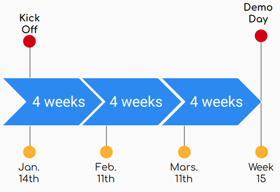

# Meeting DataForGood (2019/01/14 17:30)

* Meeting purpose: Kickoff season 2 discussing the projects, our meetings time & place and the community management.
* Meeting Location: Computas's offices, Oslo

## ATTENDING

Helga, Lingzhen, Mikkel, Anna, Ali, Dirk-Jan, Geir Arne, Patrick

## AGENDA

The agenda presented at the meeting was on these [slides](./slides/2019-01-14_DataForGood-Season_2.pdf):

- Projects
    - Feedbacks from season 1? (What to keep/change?)
    - Which projects will continue?
    - What are the new project ideas?
- Meetings
    - timeplan for the season (3 months or up to 4 months?)
    - place(s)/day to meet all together and per group?
- Organisation

## Projects

### Feedbacks from season 1? (What to keep/change?)

- **Complete autonomy to each project** rather than trying to normalize their structure: no general workshops to brainstorm the project goals or to dispath the tasks and build a Kanban board.
- **Keeping contribution limited in time** as in season 1, worked better than without specified boundaries as we had before.
- **less time hosting events to find more volunteers**. Instead, **open our "tutorial" events** solving some needs in a project: that helps current developers move on and give an opportunity for new people to get to know the project too.

### Which projects will continue?

At least:

- OrcaTag (Bjørn, Lingzhen, Mikkel)
- BySpire (Anna, Dirk-JAn, Helga, Sybolt!?)
- WomenInTech Mobile app (most probably, with Marina & Magnus)

Taking a break:

- Ratification of the United Nations treaties
- HackTechGo!

### What are the new project ideas?

- Monitoring the earth from satellite against fire: forest fire, villages burned, ... (Geir Arne, Patrick)

## Meetings

### timeplan for the season (3 months or up to 4 months?)

- stick to 3 months to end the season just before Easter holidays.
- add 2 social events to get to know people from other projects. 

### place(s)/day to meet all together and per group?

Keep having doors opened at **Computas** on **Tuesdays, 5:30PM** as a regular place and time to meet. Every group is of course free to change place and time. Weekly meeting helps to advance the project though ;)

## Organisation

### Onboardng

Onboarding at anytime during the season can take some time and effort and doesn't guaranty that the new volunteer will commit to the project.

We haven't found the perfect solution for onboarding, but asking ourself a few questions at the beginning of the project or asking a new volunteer to think about these questions might help:

- What do I want to learn during the season?
- What do I plan to achieve?
- Am I ready to commit to work a couple of hours (or more) every week for 3 months?
    IT is of course fine to "just follow" a project.

**How to onboard juniors that are willing to help?**

What about "designated begineers project": project that would put them on a path that make them ready to take part tothe next season. 

Possibilities:

- HackTechGO: hands-on sessions where we build something together with them.
- Building notebooks with Norwegian open datasets: same questions (size, schema, graphs, exploration) but a new data source each time (datanorge.no: SSB, NAV, Vegvesen, Ruter, ...)

See you all next Tuesday ;)